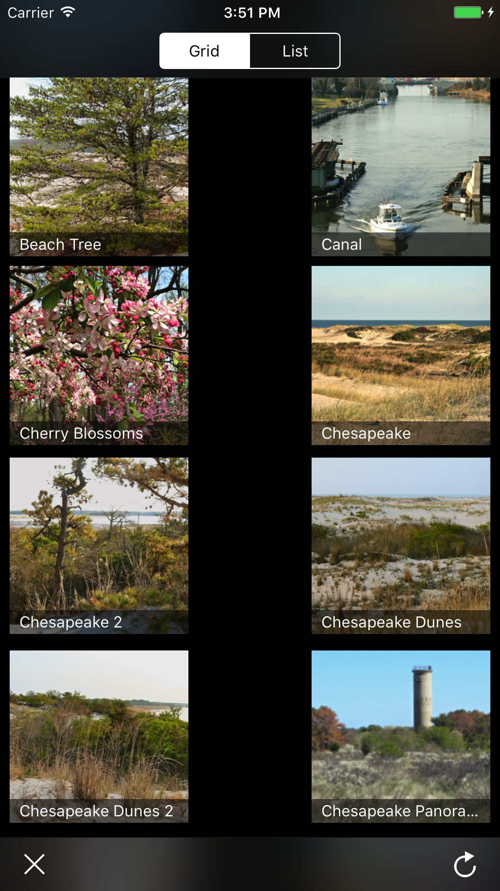
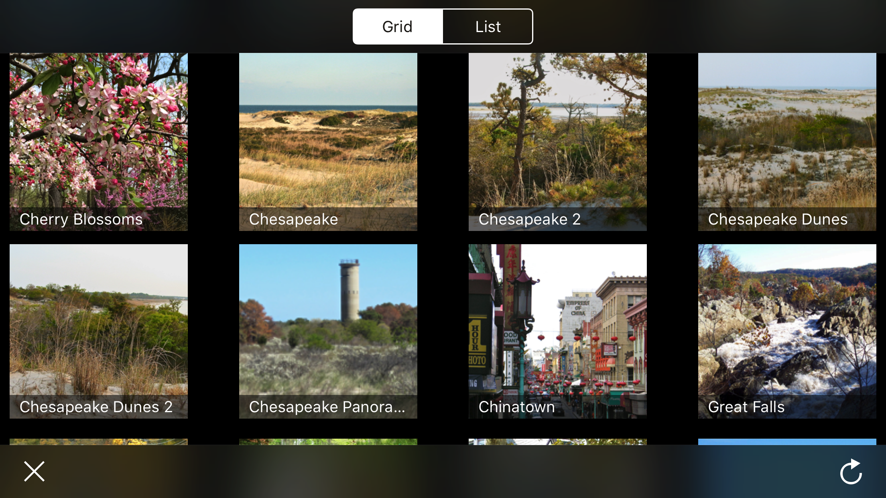
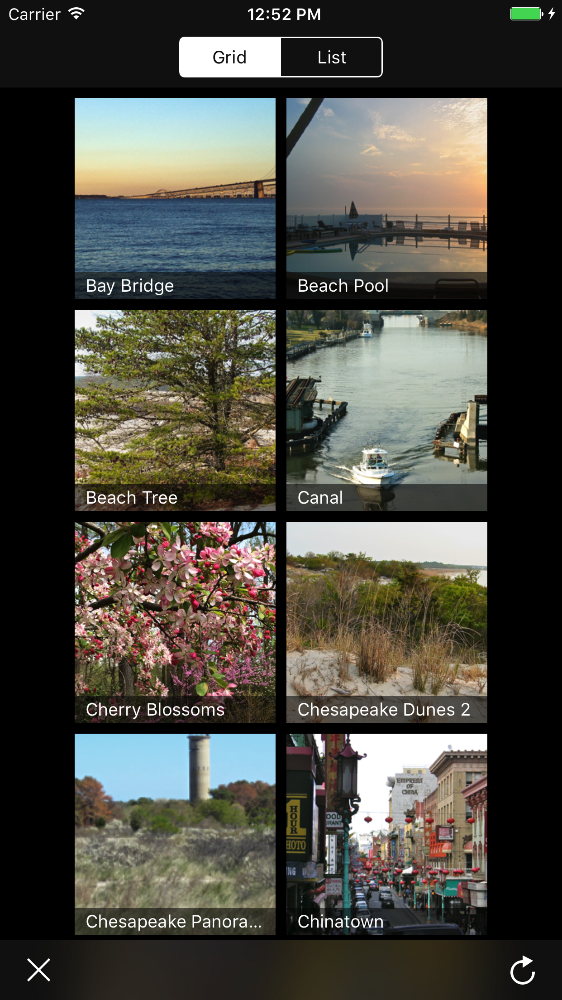
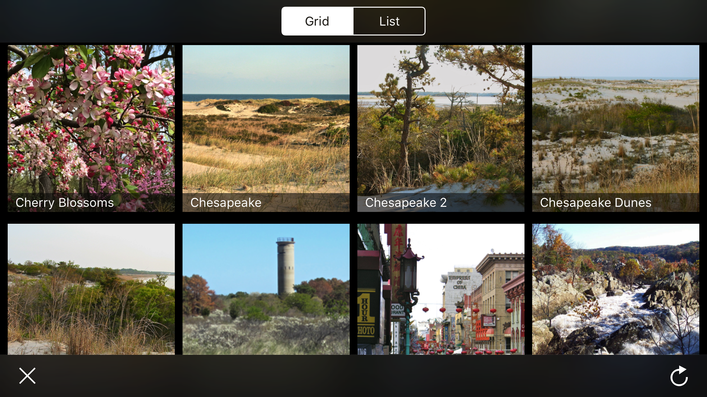
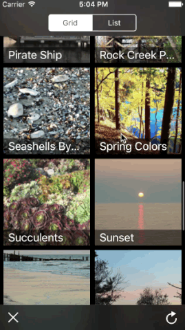

# UICollectionView-Demo

## Overview
This is an advanced UICollectionView demo with custom list layout and flexible grid layout. It demonstrates a wide variety of basic through advanced iOS techniques with a visually rich photo browsing demo. This project is intended as a tech demo to demonstrate iOS development techniques.

## Features
- UICollectionView that seamlessly transitions between list and grid layout
- **RHGridCollectionView**, a reusable collection view that can do flexible grid layouts. Unlike UICollectionView, RHGridCollectionView maintains constant spacing between cells.
- **RHParallaxScroller**, a concise and reusable utility for adding parallax scrolling to any collection view, table view, or custom view
- Simulated client/server architecture that abstracts away image downloads. This allows for very detailed testing of various synchronization issues that can occur when scrolling collection views quickly while downloading images.
- Performance optimized image caching to allow smooth scrolling while viewing a gallery of full size (several megapixel) photos
- Various UI polish details:
  - Using NSAttributedString to outline text for increased legibility
  - Using animations to mask slight performance delays
  - Cross fading between images
  - Using separate placeholder images for cached vs uncached images
  - Custom UI feedback when tapping photos
  - Navigation and tool bars that compress on landscape orientation

## Grid + List Layout

### Problem

The core feature of this demo is arranging photos in a grid or list layout. iOS's **UICollectionView** widget is very helpful this task, but it needed some customization to get the results I wanted. To see why, let's look at what happens if we tell a UICollectionView to show a grid of 148x148 thumbnails on an iPhone 6S+:

As you can see, UICollectionView's default behavior is to use flexible horizontal spacing between grid elements. I can't think of a reason why this would ever be the desired behavior. So:

### Solution

I made **RHGridCollectionView** instead of using UICollectionView directly. Given the same layout as the above UICollectionView, RHGridCollectionView's default behavior is to use flexible horizontal margins and center align contents horizontally:

This is a good layout, but it's not perfect yet because we are not using all of our horizontal screen space. So RHGridCollectionView adds support for **flexible grid layouts**:

With RHGridCollectionView, configuring this flexible layout requires just 3 lines of code, works on all devices, and automatically updates in response to screen orientation changes or any other content size changes.

Finally, there is the matter of switching to a list layout. I implemented this by adding support for **fixed column layouts** to RHGridCollectionView. Because a list layout is just a grid layout that always has one column.

## Parallax 

This demo includes a subtle UI detail that makes a noticeable difference in the end result. While scrolling photos, the photo contents shift slightly to give a perception of depth. To illustrate, here is the parallax effect I use at double the usual intensity:

This effect is from **RHParallaxScroller**, a simple utility with a single 15 line method that can implement this effect in table views, collection views, or any other scrolling view.

## Image Downloads, Multithreading, and Data Providers

By far the most challenging part of this project was solving the problem of scrolling through a photo gallery while each photo potentially spawns an image download on a separate thread. On top of typical multithreading challenges, multithreading with a collectionView is especially tricky. Collection views recycle old cells, potentially in the middle of a download. So, for example, if you have completed an image download for a cell, it is possible that the cell has been recycled and is being used for a different photo by the time the download completes.

The key to getting to the bottom of these kinds of threading issues was to simulate image downloads using the custom made **ImageDataProvider** component. The code for ImageDataProvider is still at an early stage, but the concept behind ImageDataProvider is one that I have tested in the past with great success. Instead of the usual approach of having your view controller spawn network requests directly, we abstract away data requests and responses in a **data provider**. By doing so, we can simulate specific conditions that we might not get otherwise. In the case of this app, the important part was to simulate slow downloads with a large variabilty in download speed. Combined with UI controls for reloading all images or wiping out all data at any time, we can stress test our app UI against adverse conditions that reliably generate threading complications, like wiping out all data in the middle of a fast scroll. In a different app or a future version of this demo, I might also get a lot of value out of using data providers to test error handling or to generate arbitrary data.

## Scrolling + Performance

To appreciate what you are seeing in the above gif, keep in mind that we are looking at a gallery of full size camera photos - about 4 million pixels each - and that fast scrolling is silky smooth without using much memory. Also keep in mind that this scrolling is twice as smooth on a real device - making a screen recording drops the frame rate from 60 to 30 frames per second.

To get this level of performance required a few steps:

- Creating an efficient algorithm for cropping and resizing large images to only the size needed on screen. 
- Doing all image loading asynchronously on a background thread
- Preloading images before they are needed on the screen
- Using a black square as a placeholder image while loading images from disk

The key part was to discover the **CGImageSourceCreateThumbnailAtIndex** method in the ImageIO framework. This obscure and useful method creates a square excerpt from a large photo without reading the entire photo file into memory, and is very performant. I then cropped the square image using **CGImageCreateWithImageInRect** to further reduce memory usage and improve performance.

Another important trick was to customize the UI treatment for loading an image from the disk cache instead of from a remote download. When loaded from disk, photos use a black square as a placeholder image while loading, then animate in the photo quickly. This is an example of one of my favorite tricks, which is to use animations to hide performance bottlenecks. This placeholder only shows up if you scroll very quickly, and is barely noticeable. Have you noticed it in the above video? If you look very closely, you will see that some images are slightly darker as they scroll in from the far top of the screen.

I use the same trick when autorotating or transitioning between list and grid views. The photo view fades to black, then a new view fades in. This is not just for visual flair, but to mask subtle split second delays from loading several full sized photos at once.

